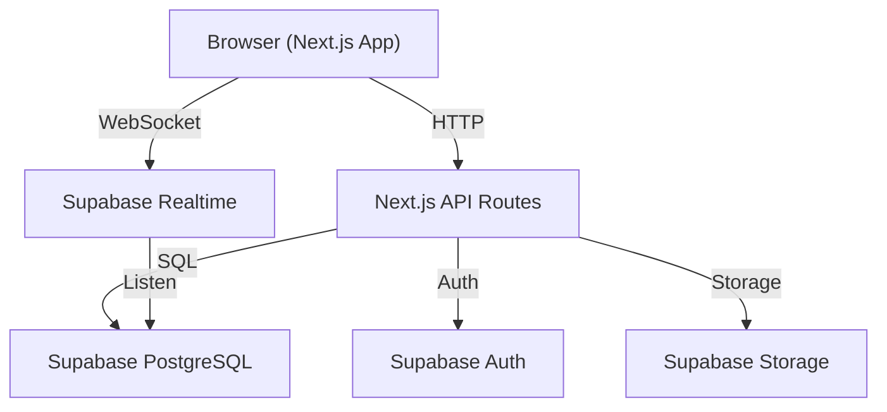
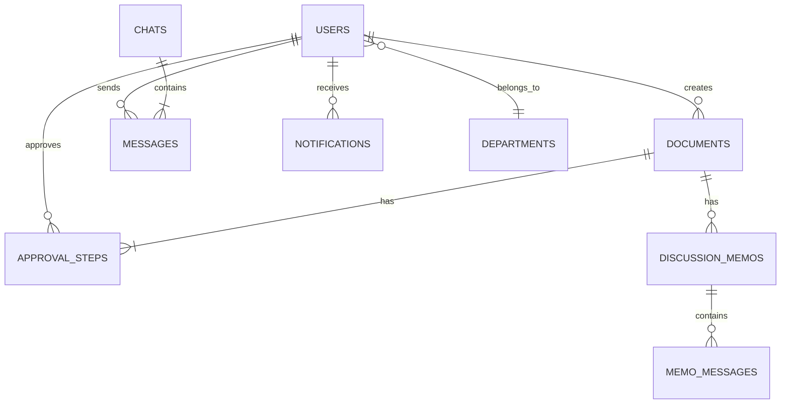

# Enterprise Chat & Sequential Approval Workflow – Implementation Plan

نظام المحادثات المؤسسية ومسار الاعتماد التسلسلي

## Background

The existing project is a **Next.js 16 + Supabase + TailwindCSS** boilerplate (`mvp-boilerplate`). We will repurpose it into an enterprise internal app. The current schema (users, products, prices, subscriptions) will be preserved but not used — a new schema will be created alongside it.

---

## User Review Required

> [!IMPORTANT]
> **Database**: We will use Supabase (PostgreSQL) for all data. The new tables will be added to [schema.sql](file:///g:/florina/nextjs/schema.sql). All real-time features use **Supabase Realtime** (built-in WebSocket layer) — no separate Socket.io server needed.

> [!IMPORTANT]
> **Styling**: Red primary color, Tajawal font (Google Fonts), RTL direction, squared icons with rounded corners. Uses existing TailwindCSS setup.

> [!WARNING]
> **Existing boilerplate**: The landing page, Stripe integration, and pricing components will be **replaced** — they are not needed for this internal app. Supabase Auth will be kept and extended.

---

## Proposed Changes — Phase by Phase

Each phase = 1 git commit, independently testable.

---

### Phase 1 – Foundation & Theme Setup

Foundation layer: RTL support, Tajawal font, red theme, new database schema, app shell layout.

#### [MODIFY] [layout.tsx](file:///g:/florina/nextjs/app/layout.tsx)
- Change `lang="en"` → `lang="ar"` and add `dir="rtl"`
- Import Tajawal font from Google Fonts via `next/font/google`
- Update metadata (title, description) to the enterprise app name

#### [MODIFY] [main.css](file:///g:/florina/nextjs/styles/main.css)
- Set red as the primary CSS custom property color palette
- Set `font-family: 'Tajawal'` globally
- Add RTL-specific utility styles

#### [MODIFY] [schema.sql](file:///g:/florina/nextjs/schema.sql)
- Add `departments` table
- Extend `users` table with `department_id`, `role`, `phone`
- Add `chats` table (direct messaging conversations)
- Add `messages` table (chat messages with optional file attachment)
- Add `documents` table (approval requests: request_number, creator_id, file_path, status)
- Add `approval_steps` table (document_id, approver_id, sequence, status)
- Add `discussion_memos` table (document_id, objector_id, creator_id, status)
- Add `memo_messages` table (messages inside a discussion memo)
- Add `notifications` table (user_id, type, title, body, read, link)
- Add RLS policies for each table
- Add Supabase Realtime publication for messages, notifications, approval_steps

#### [NEW] [app/(app)/layout.tsx](file:///g:/florina/nextjs/app/(app)/layout.tsx)
- App shell layout with **sidebar** (navigation) and **topbar** (user avatar, notifications bell)
- Sidebar links: Dashboard, Chat, Approvals, Archive, Search

#### [NEW] [components/app/Sidebar.tsx](file:///g:/florina/nextjs/components/app/Sidebar.tsx)
- Sidebar component with navigation items, icons (squared + rounded corners), and active state

#### [NEW] [components/app/Topbar.tsx](file:///g:/florina/nextjs/components/app/Topbar.tsx)
- Top bar with app name, notification bell, user avatar dropdown

#### [MODIFY] [page.tsx](file:///g:/florina/nextjs/app/page.tsx)
- Redirect `/` to `/dashboard` (or display a minimal landing/login redirect)

---

### Phase 2 – Authentication & User Management

#### [NEW] [app/(auth)/login/page.tsx](file:///g:/florina/nextjs/app/(auth)/login/page.tsx)
- RTL login page with Email + Password, using Supabase Auth
- Styled with red theme, Tajawal font

#### [NEW] [app/(auth)/register/page.tsx](file:///g:/florina/nextjs/app/(auth)/register/page.tsx)
- Registration page with full_name, email, password, department selection

#### [NEW] [app/(auth)/layout.tsx](file:///g:/florina/nextjs/app/(auth)/layout.tsx)
- Auth layout (centered card, no sidebar)

#### [NEW] [app/(app)/profile/page.tsx](file:///g:/florina/nextjs/app/(app)/profile/page.tsx)
- User profile page: view & edit name, department, avatar

#### [NEW] [utils/supabase/seed.sql](file:///g:/florina/nextjs/utils/supabase/seed.sql)
- Seed script with demo users and departments

---

### Phase 3 – Dashboard

#### [NEW] [app/(app)/dashboard/page.tsx](file:///g:/florina/nextjs/app/(app)/dashboard/page.tsx)
- 4 stat cards: Pending, Rejected/Discussing, Completed, Archived
- Recent approval requests table
- Quick action buttons: "New Approval", "New Chat"
- Data fetched via Supabase server-side queries

#### [NEW] [components/app/StatCard.tsx](file:///g:/florina/nextjs/components/app/StatCard.tsx)
- Reusable stat card component with icon, count, label

---

### Phase 4 – Chat / Messaging System

#### [NEW] [app/(app)/chat/page.tsx](file:///g:/florina/nextjs/app/(app)/chat/page.tsx)
- Chat page with split layout: conversation list (left in RTL → right) and chat window

#### [NEW] [components/app/ChatList.tsx](file:///g:/florina/nextjs/components/app/ChatList.tsx)
- List of conversations with last message preview, unread count

#### [NEW] [components/app/ChatWindow.tsx](file:///g:/florina/nextjs/components/app/ChatWindow.tsx)
- Message bubbles, input field, file attachment button
- Real-time messages via Supabase Realtime subscriptions

#### [NEW] [app/api/chat/route.ts](file:///g:/florina/nextjs/app/api/chat/route.ts)
- API route to create new chats and send messages

---

### Phase 5 – Approval Workflow: Creation

#### [NEW] [app/(app)/approvals/new/page.tsx](file:///g:/florina/nextjs/app/(app)/approvals/new/page.tsx)
- Form: upload document, enter title/description, select approvers in order (drag-reorder list)
- Submit creates `documents` + `approval_steps` records

#### [NEW] [app/api/approvals/route.ts](file:///g:/florina/nextjs/app/api/approvals/route.ts)
- POST: Create document + ordered approval_steps, set first step to `pending`, notify first approver

#### [NEW] [app/(app)/approvals/page.tsx](file:///g:/florina/nextjs/app/(app)/approvals/page.tsx)
- List of "My Approvals" (creator view) and "Awaiting My Approval" (approver view)

---

### Phase 6 – Approval Workflow: Processing

#### [NEW] [app/(app)/approvals/[id]/page.tsx](file:///g:/florina/nextjs/app/(app)/approvals/[id]/page.tsx)
- Document detail page: file preview, approval trail timeline, approve/reject buttons

#### [NEW] [app/api/approvals/[id]/approve/route.ts](file:///g:/florina/nextjs/app/api/approvals/[id]/approve/route.ts)
- POST: Mark current step as approved → advance to next step or complete

#### [NEW] [app/api/approvals/[id]/reject/route.ts](file:///g:/florina/nextjs/app/api/approvals/[id]/reject/route.ts)
- POST: Mark step as rejected → pause workflow → create discussion memo

#### [NEW] [components/app/ApprovalTimeline.tsx](file:///g:/florina/nextjs/components/app/ApprovalTimeline.tsx)
- Visual timeline component showing each approver's status

---

### Phase 7 – Discussion Memos

#### [NEW] [app/(app)/memos/[id]/page.tsx](file:///g:/florina/nextjs/app/(app)/memos/[id]/page.tsx)
- Discussion memo page: chat between rejector and creator, related to a specific document
- "Resume" and "Cancel" buttons for the creator

#### [NEW] [app/api/memos/[id]/resume/route.ts](file:///g:/florina/nextjs/app/api/memos/[id]/resume/route.ts)
- POST: Resume workflow → re-send to the rejecting approver

#### [NEW] [app/api/memos/[id]/cancel/route.ts](file:///g:/florina/nextjs/app/api/memos/[id]/cancel/route.ts)
- POST: Cancel the entire document → archive as cancelled

#### [NEW] [components/app/MemoChat.tsx](file:///g:/florina/nextjs/components/app/MemoChat.tsx)
- Real-time chat inside memo with file upload support

---

### Phase 8 – Archiving & Search

#### [NEW] [app/(app)/archive/page.tsx](file:///g:/florina/nextjs/app/(app)/archive/page.tsx)
- Archive page: list completed + cancelled documents with full history

#### [NEW] [app/(app)/search/page.tsx](file:///g:/florina/nextjs/app/(app)/search/page.tsx)
- Advanced search with filters: request number, creator name, date range, keywords
- Full-text search over documents, memos, and messages

#### [NEW] [app/api/search/route.ts](file:///g:/florina/nextjs/app/api/search/route.ts)
- GET: Search endpoint with query params for filters

---

### Phase 9 – Real-time Notifications

#### [NEW] [components/app/NotificationBell.tsx](file:///g:/florina/nextjs/components/app/NotificationBell.tsx)
- Bell icon with unread count badge, dropdown showing recent notifications
- Real-time updates via Supabase Realtime subscription on `notifications` table

#### [NEW] [app/(app)/notifications/page.tsx](file:///g:/florina/nextjs/app/(app)/notifications/page.tsx)
- Full notifications list page with mark-as-read

#### [MODIFY] [components/app/Topbar.tsx](file:///g:/florina/nextjs/components/app/Topbar.tsx)
- Integrate `NotificationBell` component

---

### Phase 10 – Polish & Security

#### [MODIFY] [schema.sql](file:///g:/florina/nextjs/schema.sql)
- Finalize all RLS policies ensuring users can only access their own data

#### Various Component Files
- Add hover effects, micro-animations, glassmorphism effects
- Ensure all icons have squared shape with rounded corners
- Final responsive layout adjustments

---

## Architecture Diagram

## Data Model

---

## Verification Plan

### Per-Phase Browser Testing

Each phase will be verified using the **browser tool** after running `npm run dev`:

| Phase | Verification Steps |
|-------|-------------------|
| 1 | Open `http://localhost:3000` → verify RTL layout, Tajawal font renders, red theme colors visible, sidebar + topbar display correctly |
| 2 | Register a new user → Login → verify redirect to dashboard → verify profile page loads |
| 3 | Login → dashboard shows 4 stat cards with correct counts (0 initially), quick action buttons clickable |
| 4 | Open chat → create new conversation → send message → verify it appears in real time |
| 5 | Create new approval request → verify document + steps created → first approver sees it |
| 6 | Login as approver → approve/reject → verify workflow advances or pauses |
| 7 | After rejection → open memo → send messages → resume or cancel → verify workflow state |
| 8 | Search for an archived document → verify filters work, results display correctly |
| 9 | Trigger an action → verify notification bell shows unread count → click to see notification |
| 10 | Try accessing another user's data via URL → verify RLS blocks it |

### Manual Verification (by user)

The user should:
1. Run `npm run dev` and open `http://localhost:3000`
2. Register 3-4 test users in different browser sessions/incognito windows
3. Create an approval workflow with User A, assign B → C → D as approvers
4. Login as B, approve → login as C, reject → verify memo opens between C and A
5. As A, upload revised doc in memo, click "Resume" → verify C gets it again
6. Approve through C and D → verify "Completed" notification for A
7. Search for the document in archive → verify full history is accessible
